# SignalR ile QR Kodlu Sipariş ve Yönetim Sistemi

Bu proje, **ASP.NET Core 8.0** ile geliştirilen, restoranlar ve kafeler için QR kod destekli modern bir **Sipariş ve Yönetim Sistemi**dir. Gerçek zamanlı sipariş takibinden rezervasyon yönetimine kadar birçok özellik sunmaktadır.

---

## 🚀 Özellikler

### Genel Özellikler
- **QR Kod ile Menü ve Sipariş**: 
  - QR kod taramasıyla menüye ulaşma ve sipariş oluşturma.
- **Gerçek Zamanlı Sipariş Takibi**: SignalR entegrasyonu ile canlı bildirimler.
- **Rezervasyon Yönetimi**: Masaların rezervasyon durumlarını güncelleme ve takip.
- **İndirimler ve Kampanyalar**: Özel indirimlerin tanımlanması ve yönetimi.
- **İstatistikler**: Sipariş, gelir, kullanıcı sayıları gibi önemli verilerin raporlanması.
- **Bildirimler**: Admin panelinde önemli uyarılar ve kullanıcı bildirimleri.
- **Slider ve Referans Yönetimi**: Ana sayfada slider ve referans alanlarını dinamik olarak güncelleme.
- **Hakkımızda ve İletişim**: İçeriklerin dinamik olarak düzenlenmesi.
- **Mesajlar ve E-posta Gönderimi**: Kullanıcı mesajlarını görüntüleme ve cevaplama.
- **Sosyal Medya Ayarları**: Sosyal medya hesaplarının bağlantılarını yönetme.
- **Ayarlar ve Çıkış**: Uygulama genel ayarları ve oturum kapatma.

### Admin Paneli
- Ürünler ve Kategoriler
- Masalar ve Masa Durumları
- Rezervasyon Yönetimi
- Slider Yönetimi
- Bildirimler
- İstatistikler
- Hakkımızda
- İndirim Yönetimi
- İletişim Bilgileri
- Referanslar
- Mail Gönderimi
- Çıkış

---

## 🛠️ Kullanılan Teknolojiler

- **Backend**: ASP.NET Core 8.0
- **Gerçek Zamanlı İletişim**: SignalR
- **Veritabanı**: Microsoft SQL Server
- **QR Kod**: QRCoder Kütüphanesi
- **RapidApi**: Tasty Apisi
- **Frontend**: 
  - HTML5, CSS3, JavaScript
  - Bootstrap
  - AJAX
- **Katmanlı Mimari**:
  - EntityLayer
  - DataAccessLayer
  - BusinessLayer
  - DtoLayer (Data Transfer Objects)
  - ApiLayer
  - PresentationLayer (Admin Panel ve Kullanıcı Arayüzü)

---

## 📂 Proje Yapısı

### 1. **Katmanlar**
- **EntityLayer**: Varlık sınıfları (ör. `Product`, `Category`, `Reservation`, `Table`).
- **DataAccessLayer**: 
  - `Entity Framework` ile veritabanı erişimi.
  - Generic repository yapısı.
- **BusinessLayer**: İş mantıkları, validasyonlar ve servisler.
- **DtoLayer**: Data Transfer Object sınıfları (ör. `ProductDto`, `CategoryDto`).
- **ApiLayer**: API yönetimi ve SignalR hub'ları.
- **PresentationLayer**: Admin paneli ve kullanıcı arayüzü.

### 2. **SignalR Hub**
SignalR, gerçek zamanlı iletişim sağlamak için kullanılır. Bu sınıf, restoran yönetimi için önemli verilere anlık erişimi sağlar:

- **Gerçek Zamanlı İstatistikler**: Sipariş, rezervasyon durumu, kasa bilgileri gibi veriler anında iletilir.
- **Rezervasyon ve Masa Durumu**: Masaların durumu ve rezervasyon bilgileri her an güncellenir.
- **Bildirimler**: Admin panelindeki yeni bildirimler anlık olarak kullanıcıya iletilir.
- **Sipariş ve Finansal Veriler**: Aktif siparişler ve günlük satış miktarı anında güncellenir.

### 3. **Dependency Injection (Bağımlılık Enjeksiyonu)**
Proje, bağımlılıkları kolay yönetebilmek ve test edilebilirliği artırmak için Dependency Injection (DI) altyapısını kullanır. Katmanlar arası iletişim, servisler ve repository sınıfları DI ile kontrol altına alınmıştır. Bu yaklaşım, bağımlılıkların gevşek bir şekilde bağlanmasını sağlar ve proje genelinde daha esnek bir yapı sunar.

### 4. **RapidAPI ile Yemek Tarifleri**
Sistem, kullanıcı deneyimini geliştirmek için **RapidAPI** entegrasyonunu kullanarak yemek tariflerini ve videolarını dinamik bir şekilde çekmektedir.

### RapidAPI Özellikleri:
- **Yemek Videolarına Erişim**: 
  - Kullanıcılar, menüdeki yemekler için ilham verici ve eğitici yemek videolarını izleyebilir.
- **Zengin İçerik**: 
  - Videolar, yemeklerin hazırlanış aşamalarını ve sunum önerilerini içermektedir.
- **API Kullanımı**: 
  - RapidAPI üzerinden sağlanan verilerle, farklı mutfaklardan yemeklerin videolu tarifleri sunulmaktadır.

Bu özellik, müşterilerin menüdeki yemekler hakkında daha fazla bilgi edinmesini sağlar ve restoranın modern bir imaj oluşturmasına katkıda bulunur.
## 📦 Kurulum

### Gereksinimler:
- Visual Studio 2022
- .NET 8 SDK
- SQL Server

### Adımlar:
1. Bu repoyu klonlayın:
   ```bash
   git clone https://github.com/f4t1hsalih/RestaurantSignalR.git

## Proje Resimleri
Aşağıda projeye ait bazı ekran görüntüleri bulunmaktadır:


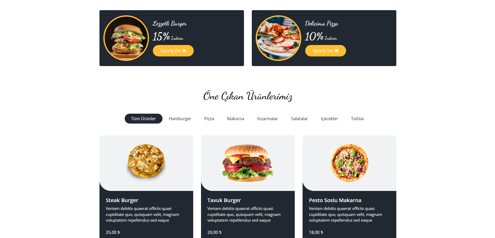
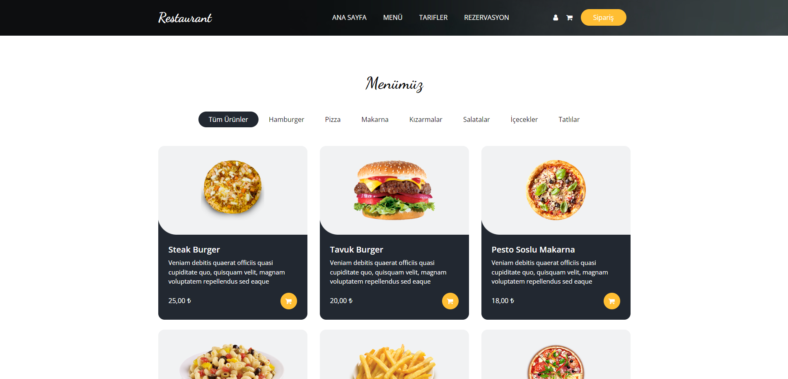
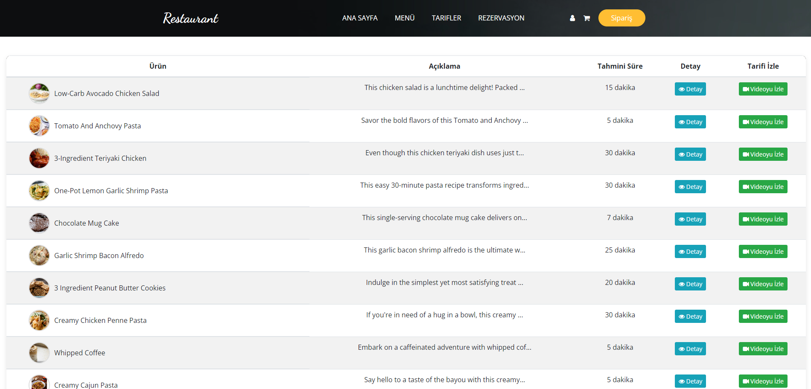
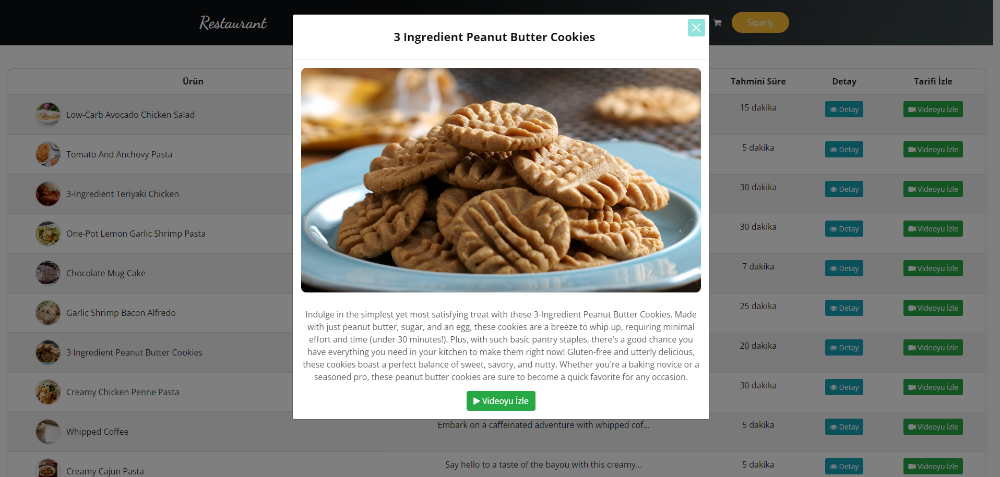
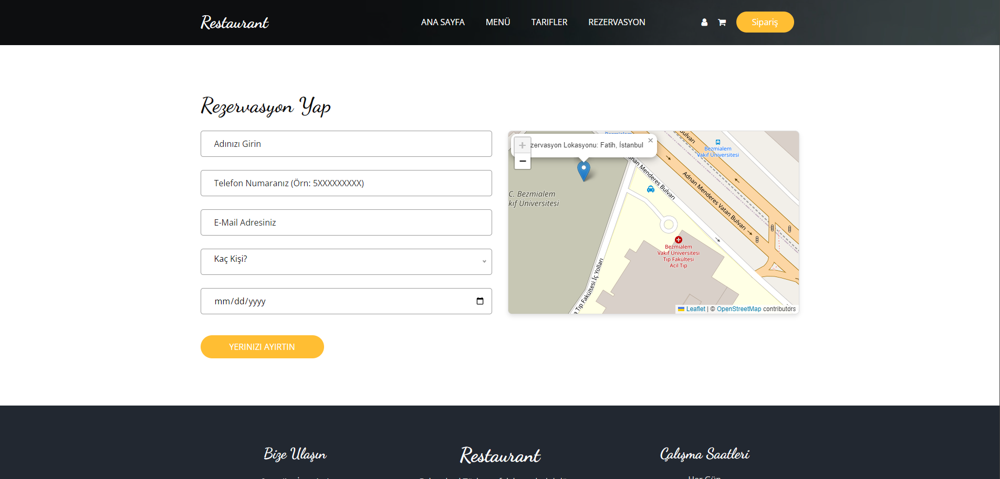
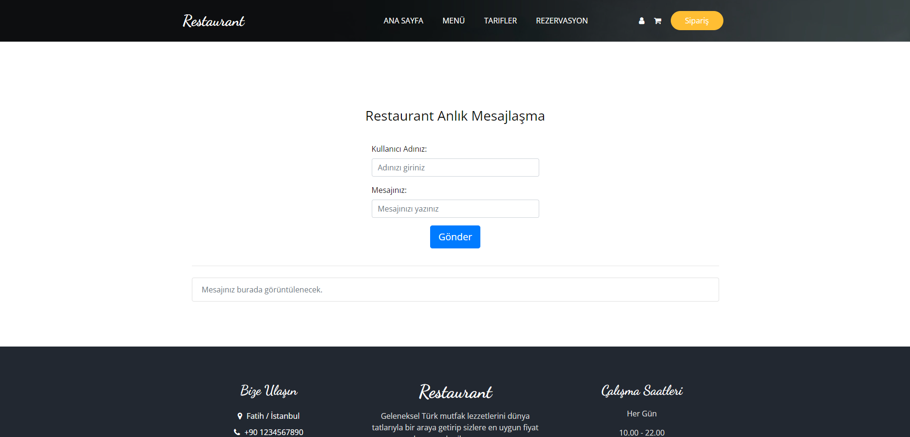
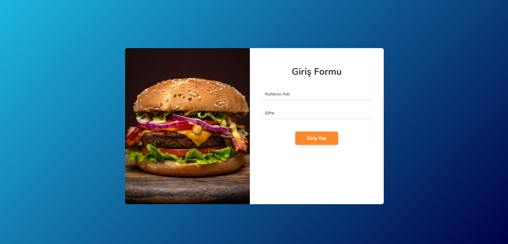
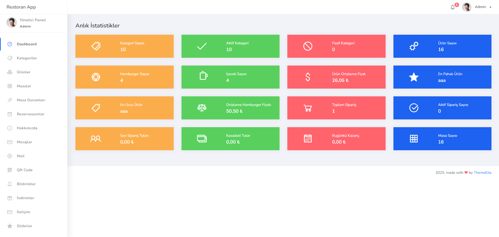

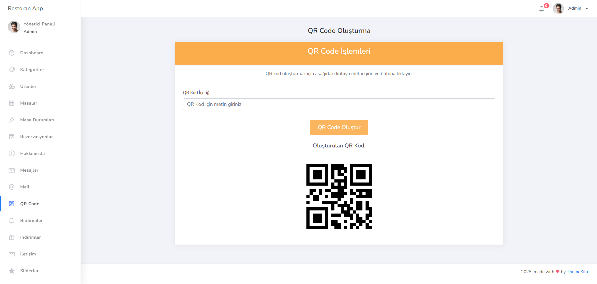
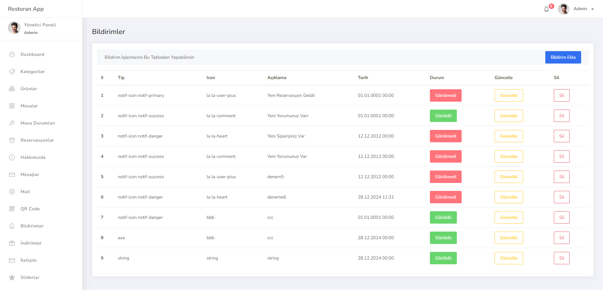
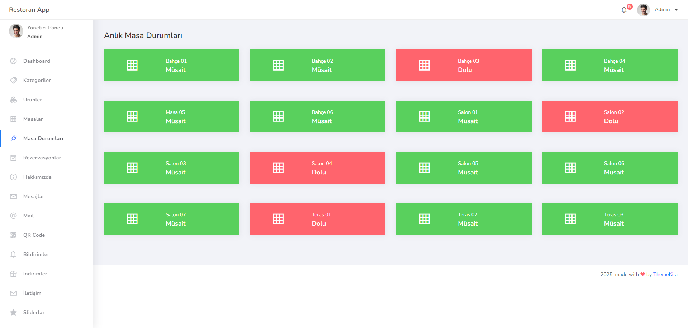

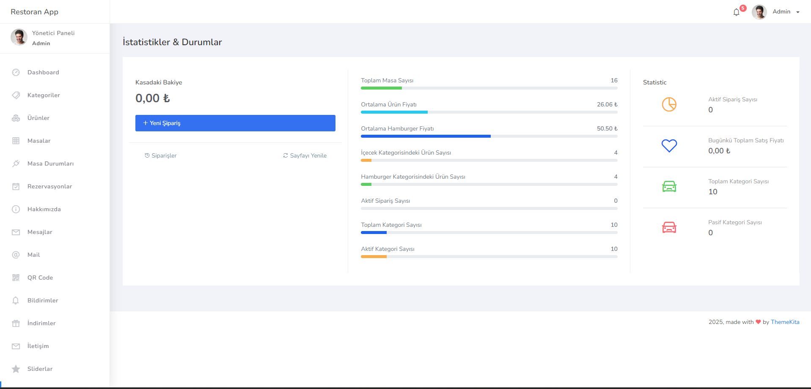
